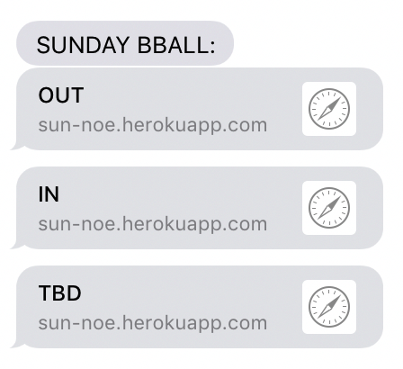

# Sunday @ Noe Roll Call
The one-click reply "app" for Sunday morning b-ball @ Upper Noe.

---
## Two Goals:

1. One click to reply
2. Do so via text

This did not exist in any existing service we could find.
So we made this little bootleg one.

---
## How to Use This

If you care to be here, you are probably part of the game.
Your name is then also in the super-secret Google Sheet which serves as our "player database".

Every so often (maybe once or twice a week), 
You will receive receive 3 links from a weird number (12674777207)
They will look like this:

Those links are *personalized* for you, with an ID read from the Sheet, for example:

* http://*site*/**SOME_NICKNAME**/IN
* http://*site*/**SOME_NICKNAME**/OUT
* http://*site*/**SOME_NICKNAME**/TBD

Just click on one.  It'll update the "Sunday" column in the sheet.

---
# Some More Customization

The nicknames are initially made by me (as sarcastically as possible) -
but can be edited just as easily in the Sheet, under the (typically hidden) "ID" column:

Name  |  Email  |  ID  | Phone  | Sunday |
---  |  ---  |  ---  | ---  | --- |
Joe Schmo | jscho@gmail.com | schmo  | 5556667777| TBD |
Jack Mehoff  | jack@gmail.com | mehoff | 1234567890| TBD | 

Would correspond to "reply" links like:

* http://*site*/**schmo**/IN
* http://*site*/**mehoff**/OUT

Set those IDs to whatever you want.
Just make something it remains a valid web address - for example dont try "ID = *http://steve.com*".
That ain't gonna work.

---
## Why Make This Anyway

Something like:

* 50% because it's better than pestering you by email.  (You never check your effing email.)
* 50% because I realized I knew how to make 85% of it, and figured figuring out the other 15% would be interesting enough.
* 10% because it ain't all that hard.  (See below.)

---
## How TF Does This Work

There's about a hundred lines of python code running this.
A handful of services make this pretty easy:

* The "site" uses [Flask](http://flask.pocoo.org/).
* [Heroku](https://www.heroku.com) makes running it really easy, and free.
* [gspread](https://github.com/burnash/gspread) makes reading and writing the Google Sheet easy
* [Twilio](https://www.twilio.com/) sends the SMS messages, for a small fee.
  * Twilio also wrote this nice post which helped piece the Google-Doc piece together. [Shout-out to them.](https://www.twilio.com/blog/2017/02/an-easy-way-to-read-and-write-to-a-google-spreadsheet-in-python.html)

---
## Copyright

TODO: link to the "do what the fuck you want" license.

---
## What Would Make This Better

A million things, including:

* Smarter ping'ing, based on already-expressed status
* Some indication of if/ when you hit up an "invalid player" page
* Read-only status (so we don't have to publish the editable sheet)
* Auto/ scheduled ping'ing (so far I still hit "send to all" manually)
* Getting someone else to make it, instead of me.

etc, etc

